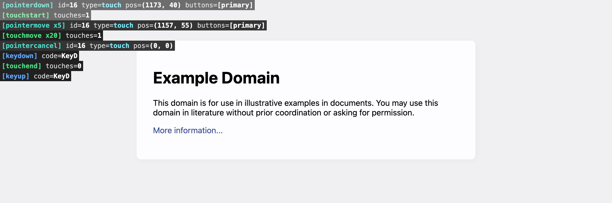

# Event Debugger Extension for Chrome

This extension provides an overlay for debugging events on a web page. It is useful for debugging basic event properties and event capturing.

## Installation

1. Clone this repository.
2. Open Chrome and navigate to `chrome://extensions`.
3. Enable "Developer mode" in the top right corner.
4. Click "Load unpacked" and select the `extension/` subdirectory of this repository.
5. (Optional) Assign a keyboard shortcut in `chrome://extensions/shortcuts` page.
